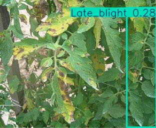

\# Tomato Leaf Disease Detection Using YOLOv8

\## Project Overview

This project uses Artificial Intelligence and Computer Vision to detect tomato leaf diseases using the YOLOv8 object detection model.

\## Model Used

\- YOLOv8n (YOLOv8 Nano)

\- Training Epochs: 100

\- Image Size: 640

\- Batch Size: 16

\## Diseases Detected

\- Bacterial Spot

\- Early Blight

\- Healthy

\- Late Blight

\- Leaf Mold

\- Target Spot

\- Black Spot

\## Dataset

Dataset: Tomato Leaf Diseases Detection Computer Vision Dataset

\## Results

\- Precision: 69.75%

\- Recall: 77.65%

\- mAP50: 74.95%

\- mAP50-95: 49.71%

## Prediction Results

### Late Blight Prediction

The model detected Late Blight on a tomato leaf image.

### Second Leaf Prediction

The model predicted Late Blight on another tomato leaf image.

### Healthy Leaf Prediction

The model tested a healthy tomato leaf and detected no disease.

\## Technologies Used

\- Python

\- YOLOv8

\- Ultralytics

\- OpenCV

\- PyTorch

\- Google Colab

\## Project Structure

Tomato-Leaf-Disease-Detection-YOLOv8/

\- tomato\_leaf\_best.pt

\- requirements.txt

\- predictions/

